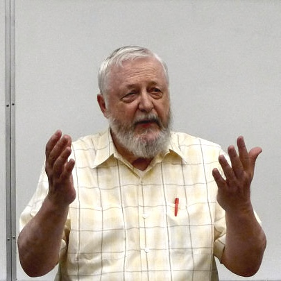
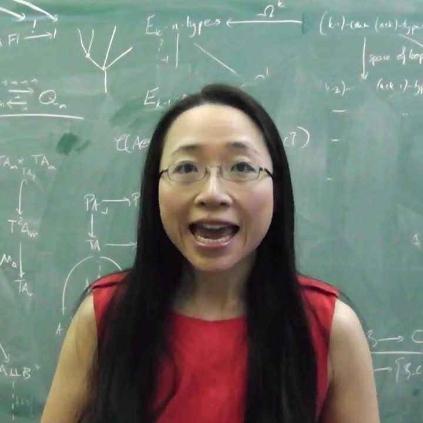
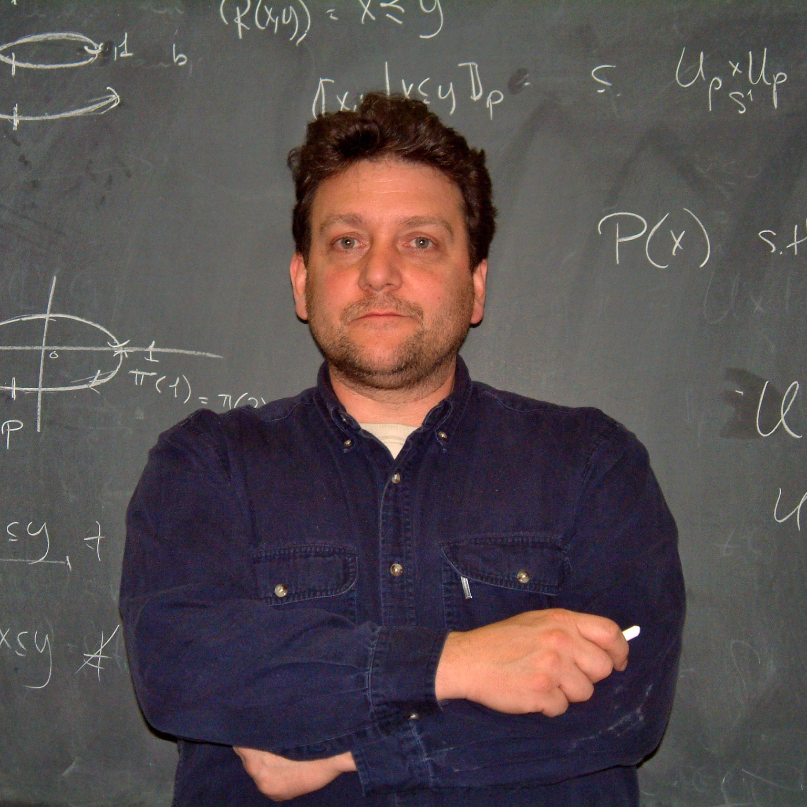
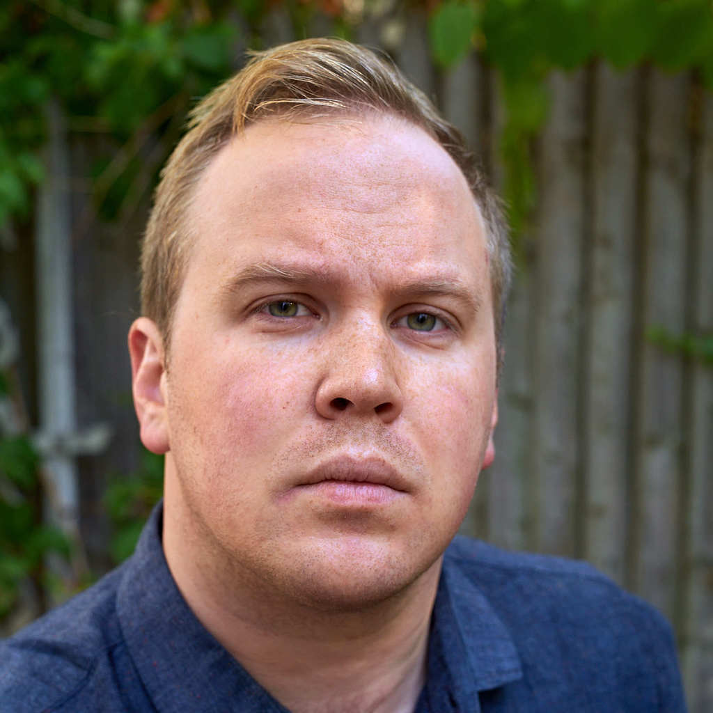
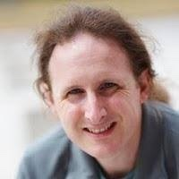
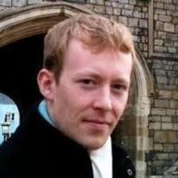

theme: Next, 1
build-lists: true
autoscale: true

# [fit]Category Theory*
*for people who can't be bothered to learn it

^Note: This presentation is designed to be viewed with [http://www.decksetapp.com/](http://www.decksetapp.com/).

---

# [fit]Category Theory*
*for people who can't be bothered to learn it

## _or_

---

# [fit]Category Theory*
*for people who can't be bothered to learn it

## _or_
### “Category Theory for Programmers”

---

# [fit]Category Theory*
*for people who can't be bothered to learn it

## _or_
### “Category Theory for Programmers” for Programmers

---

 
 
# Steven Syrek
## @sjsyrek

---
# Who this workshop is not for
1. Category theorists

---

---

# Who this workshop is not for
1. Category theorists
2. Professional Haskell developers

---

---

# Who this workshop is not for
1. Category theorists
2. Professional Haskell developers
3. Smart people who already understand the Yoneda lemma

---

---

# Who this workshop is not for
1. Category theorists
2. Professional Haskell developers
3. Smart people who already understand the Yoneda lemma
4. Anyone looking for "practical applications" of adjunctions, kan extensions, ends, coends, presheaves, Bousfield localizations, Day convolutions, fibers, Tannakian dualities, tensor products, etc.

---

# Goals

1. Define category theory and its most important concepts
2. Discuss the relevance of CT to programming
3. Practice abstract thinking in concrete terms
4. Avoid getting into the weeds 👋
5. Draw not too many diagrams

---

# definition

---
