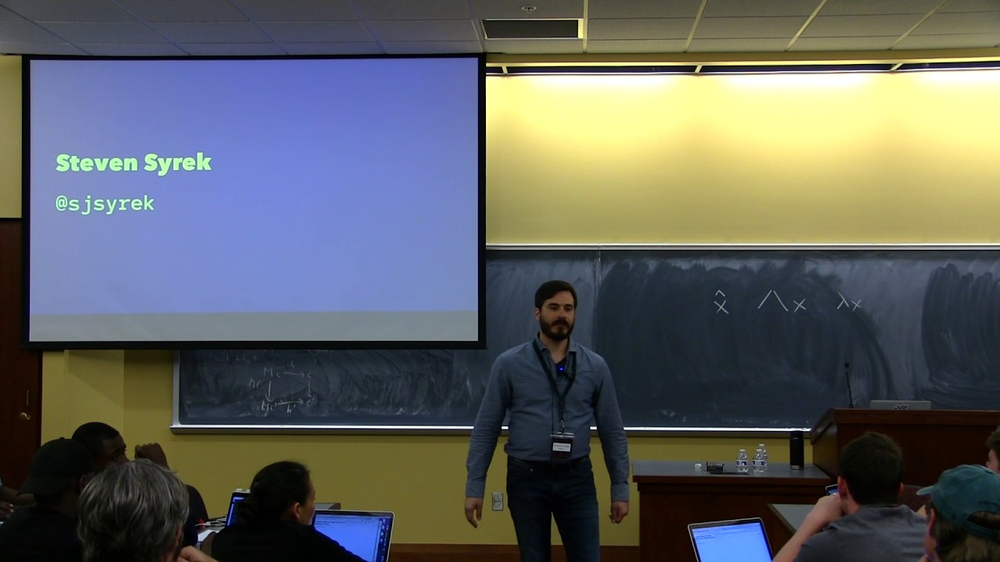
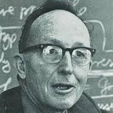
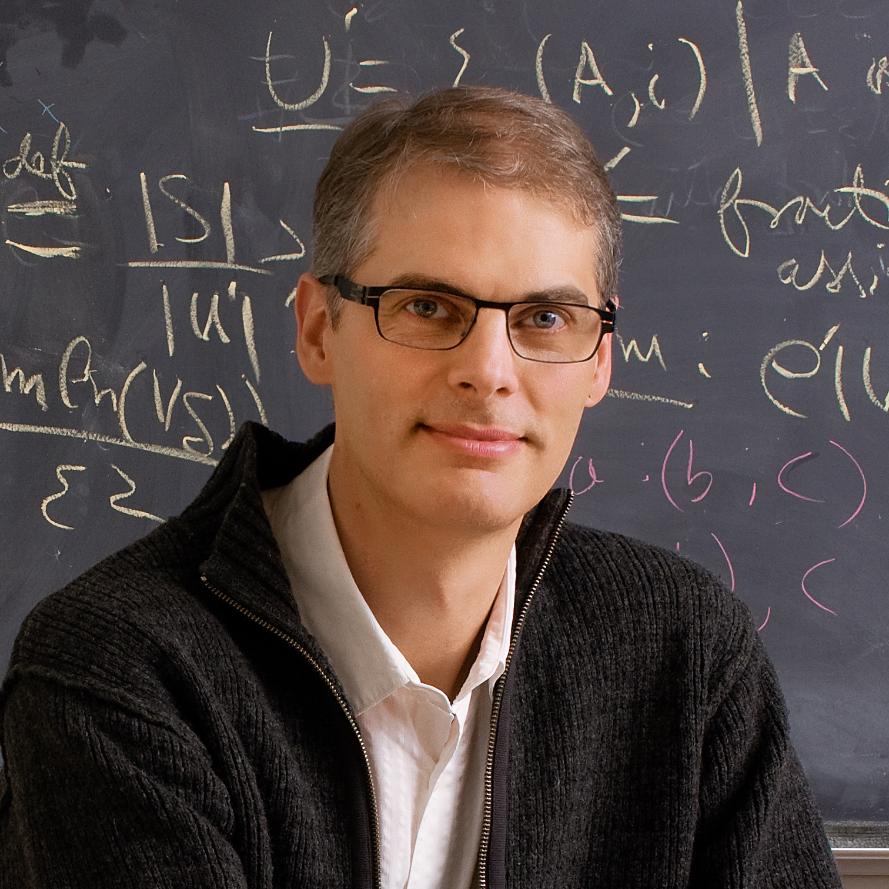
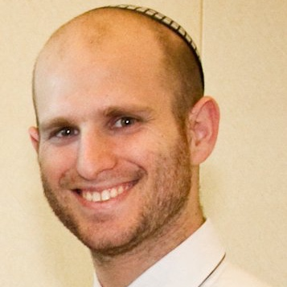

theme: Merriweather, 4
build-lists: true
autoscale: true

# [fit]Category Theory<sup>\*</sup>

<sup>\*</sup>for people who can't be bothered to learn it

^Note: This presentation is designed to be viewed with [http://www.decksetapp.com/](http://www.decksetapp.com/).

---

# [fit]Category Theory<sup>\*</sup>

<sup>\*</sup>for people who can't be bothered to learn it

## _or_

---

# [fit]Category Theory<sup>\*</sup>

<sup>\*</sup>for people who can't be bothered to learn it

## _or_

### “Category Theory for Programmers”

---

# [fit]Category Theory<sup>\*</sup>

<sup>\*</sup>for people who can't be bothered to learn it

## _or_

### “Category Theory for Programmers” for Programmers

---

<br>
<br>
# Steven Syrek
## @sjsyrek

---



---

# Who this workshop is not for

1.  Category theorists

---





---

[.build-lists: false]

# Who this workshop is not for

1.  Category theorists
2.  Professional Haskell developers

---



---

[.build-lists: false]

# Who this workshop is not for

1.  Category theorists
2.  Professional Haskell developers
3.  Smart people who already understand the Yoneda lemma

---


---

[.build-lists: false]

# Who this workshop is not for

1.  Category theorists
2.  Professional Haskell developers
3.  Smart people who already understand the Yoneda lemma
4.  Anyone looking for “practical applications” of adjunctions, kan extensions, ends, coends, presheaves, Bousfield localizations, Day convolutions, fibers, Tannakian dualities, tensor products, comonads, strong lax monoidal functors, limits, cones, bicategories, F-algebras, coalgebras, bialgebras, higher-dimensional categories, groupoids, localizing subcategories, etc.

---

# Goals

1.  Define category theory and its most important concepts
2.  Discuss the relevance of CT to programming
3.  Practice abstract thinking in concrete terms
4.  Avoid getting into the weeds 👋
5.  Draw not too many diagrams

---

# What is category theory?

---

# What is a function?

---

# Types of functions

* injective (one-to-one)
* surjective (onto)
* bijective
* total
* partial
* inverse
* homomorphism
* isomorphism
* endomorphism

---

# composition

f : a → b
g : b → c
g ◦ f : a → c

```
(.) :: (b -> c) -> (a -> b) -> a -> c
f :: a -> b
g :: b -> c
g . f :: a -> c
```

---

# identity

1<sub>a</sub> : a → a
f : a → b
1<sub>b</sub> ◦ f = f
f ◦ 1<sub>a</sub> = f

```
id :: a -> a
f :: a -> b
id . f = f
f . id = f
```

---

# associativity

f : a → b
g : b → c
h : c → d
(h ◦ g) ◦ f = h ◦ (g ◦ f) = h ◦ g ◦ f

```
f :: a -> b
g :: b -> c
h :: c -> d
(h . g) . f = h . (g . f) = h . g . f
```

---

# Composition is like brewing beer

malt → mill → mash → boil → ferment → bottle → drink → regret

```
malt . mill . mash . boil . ferment . bottle . drink . regret
```

---

# What is category theory?

---

# definitions

* category
  * ~~set~~
  * collection
  * universe
* object
  * ~~element~~
  * abstraction
  * pattern
* arrow
  * ~~function~~
  * map
  * morphism

---

# important concepts

* category
* object
* arrow
* functor
* natural transformation

---

# Functor laws

F (id<sub>x</sub>) = id<sub>F(X)</sub>
F (g ◦ f) = F g ◦ F f

```
fmap id == id
fmap (f . g) == fmap f . fmap g
```

---

# Natural Transformations

**Naturality condition**
component<sub>Y</sub> ◦ F f = G f ◦ component<sub>X</sub>
η<sub>Y</sub> ◦ F f = G f ◦ η<sub>X</sub>

```
component :: forall a. F a -> G a
fmap f . component == component . fmap f
```

---

# Categories in Haskell

```
class Category arrow where
  identity :: arrow a a
  compose  :: arrow b c -> arrow a b -> arrow a c

instance Category (->) where
  identity    x = x
  compose f g x = f (g x)

class Monoid a where
  mempty  :: a
  mappend :: a -> a -> a
```

---

# What is category theory?

---

# Further reading

* Awodey, Steve. _Category Theory_. Oxford: Oxford University Press, 2010.
* Cheng, Eugenia. _How to Bake Pi: An Edible Exploration of the Mathematics of Mathematics_. New York: Basic Books, 2015.
* Lawvere, F. William, and Stephen H. Schanuel. _Conceptual Mathematics, 2nd Edition: A First Introduction to Categories_. Cambridge: Cambridge University Press, 2012.
* Mac Lane, Saunders. _Categories for the Working Mathematician_. New York: Springer, 2010.
* Milewski, Bartosz. _Category Theory for Programmers_. 2017.
* Pierce, Benjamin C. _Basic Category Theory for Computer Scientists_. Cambridge, Mass: The MIT Press, 1991.
* Spivak, David I. _Category Theory for the Sciences_. Cambridge, Mass: The MIT Press, 2014.
* Spivak, David I. and Brendan Fong. _Seven Sketches in Compositionality: An Invitation to Applied Category Theory_. 2018.

**Further viewing**

* [TheCatsters](https://www.youtube.com/user/TheCatsters)
* [Category Theory for Programmers](https://www.youtube.com/user/DrBartosz/videos)

[`https://github.com/sjsyrek/presentations/tree/master/category-theory`](https://github.com/sjsyrek/presentations/tree/master/category-theory)
